# 💳 ATM Management System – GTK+ Version

A modern **ATM management system** built in **C**, using **GTK+** for graphical interface and **SQLite** for persistent data storage.

---

## ✨ Features

- **Graphical User Interface (GUI)** with GTK+
- **User Authentication** (Login / Register)
- **Create** new bank accounts
- **Update** account info (country, phone)
- **View** specific or all accounts
- **Deposit / Withdraw** money (except fixed accounts)
- **Remove** accounts
- **Transfer** account ownership to other users
- **Live Transfer Notifications** using multithreading + shared memory
- **Dialog Windows** for input and feedback

---

## 🛠️ Tech Stack

| Tech         | Usage                         |
|--------------|-------------------------------|
| C            | Core language                 |
| GTK+         | GUI                           |
| SQLite3      | Database                      |
| pthreads     | Notifications (Multithreading)|
| mmap/shm     | Shared memory for notifications |

---

## 🗃️ Database Structure

### **users.db**
- `id` (int)
- `username` (text)
- `passwordHash` (text)

### **records.db**
- `id` (int)
- `accountNbr` (int)
- `amount` (real)
- `userId` (int)
- `username` (text)
- `country` (text)
- `phone` (text)
- `accountType` (text)
- `depositDate` (text)

---

## 🛠️ Build Instructions

### 1. Install Required Libraries:
```bash
sudo apt install libgtk-3-dev libsqlite3-dev libssl-dev
```

### 2. Compile
```bash
make gtk
```

### 3. Run
```bash
./gtk_atm
```

---

## 📸 GTK+ Preview

### 🔐 Login Window
```
+--------------------------+
| Username: [___________] |
| Password: [___________] |
| [ Login ]  [ Cancel ]   |
+--------------------------+
```

### 📊 Main Menu
```
+---------------------------+
| Welcome, username        |
|---------------------------|
| [1] Create Account       |
| [2] Update Info          |
| [3] Check Account        |
| [4] All Accounts         |
| [5] Transaction          |
| [6] Remove Account       |
| [7] Transfer Ownership   |
| [8] Exit                 |
+---------------------------+
```

> All actions are handled via GUI dialogs for a smoother user experience.

---

## 👾 Notifications
- Transfers are **instantly notified** across different instances using `shared memory`.
- If someone transfers an account to your user, a popup appears:

```
+--------------------------------------+
| 🔔  Someone transferred an account! |
| [  OK  ]                            |
+--------------------------------------+
```

---

## 🖼️ Screenshots (GTK+ GUI)

- **Init Menu**  
  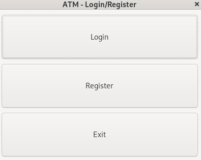

- **Register**  
  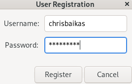

- **Login**  
  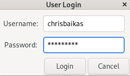

- **Main Menu**  
  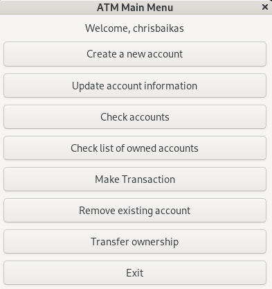

- **Create Account**  
  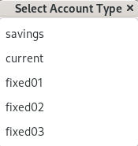

- **Update Account**  
  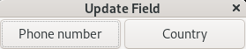

- **Check Account Details**  
  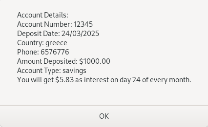

- **Check All Accounts**  
  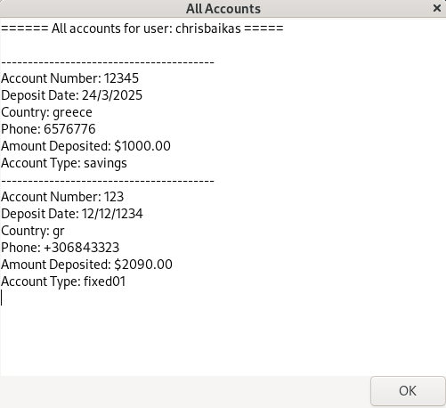

- **Make Transaction**  
  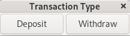

- **Remove Account**  
  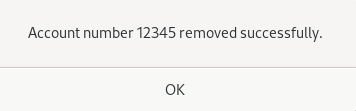

- **Transfer Notification (Real-Time)**  
  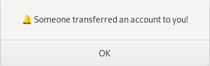

- **Success Dialog**  
  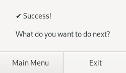

- **Exit Dialog**  
  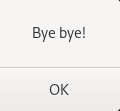

---

## 👨‍💼 Author
**Chris Baikas**
- GTK+ ATM Project – Zone01 School
- GUI Banking System written in C
- SQLite & GTK+ integration with threads & notifications

---

## 📚 License

This project was developed as part of the **Zone01** program and is intended for **educational** purposes only.

All rights reserved to the author. 
Feel free to contribute, extend, or fork under fair use.