# 🏧 ATM Management System – **Ncurses Terminal Edition**

A complete **ATM Management System** written in **C**, featuring a fully interactive terminal interface built with **Ncurses**, persistent data via **SQLite**, and live user-to-user **notifications** using **multithreading** and **shared memory**.

---

## ✨ Features

- 🔐 **Login / Register** with hashed passwords
- 🧾 **Create** new accounts
- ✏️ **Update** account info (country, phone)
- 🔍 **Check** account details or full list
- 💰 **Deposit / Withdraw** (except fixed accounts)
- 🗑️ **Remove** existing accounts
- 🔄 **Transfer ownership** of accounts
- 🔔 **Live notifications** via shared memory + threads
- 🎛️ **Ncurses-based interactive UI** with keyboard navigation

---

## 💠 Tech Stack

| Tech        | Purpose                    |
|-------------|----------------------------|
| `C`         | Core logic                 |
| `SQLite3`   | Database backend           |
| `Ncurses`   | Terminal-based GUI         |
| `Pthreads`  | Background notification    |
| `shm_open`  | Inter-process communication |

---

## 📃 Database Schema

### 📁 users.db

| Column       | Type    |
|--------------|---------|
| `id`         | INTEGER |
| `username`   | TEXT    |
| `passwordHash` | TEXT  |

### 📁 records.db

| Column        | Type    |
|---------------|---------|
| `id`          | INTEGER |
| `accountNbr`  | INTEGER |
| `amount`      | REAL    |
| `userId`      | INTEGER |
| `username`    | TEXT    |
| `country`     | TEXT    |
| `phone`       | TEXT    |
| `accountType` | TEXT    |
| `depositDate` | TEXT    |

---

## 🪰 Build Instructions

### ✅ Prerequisites

Make sure you have the following libraries installed:

```bash
sudo apt install libsqlite3-dev libncurses5-dev
```

### 🏗️ Compile

```bash
make
```

### ▶️ Run

```bash
./atm
```

---

## 🖥️ Interface Preview

### 🔐 Login Screen

```
======= ATM =======
-->> Login / Register <<--

[1] Login
[2] Register
[3] Exit
```

### 📋 Main Menu

```
======= ATM =======
Welcome, username

[1] Create a new account
[2] Update account information
[3] Check accounts
[4] Check list of owned accounts
[5] Make Transaction
[6] Remove existing account
[7] Transfer ownership
[8] Exit
```

---

## 🎮 Navigation

- Use **arrow keys** or number keys (`1-8`) to select options.
- Input fields are typed and confirmed with **Enter**.
- Some options require confirmation (e.g. `y/n`, `Enter`, or custom fields).

---

## ⚠️ Notes

- Fixed accounts (`fixed01`, `fixed02`, `fixed03`) do **not allow** deposits or withdrawals.
- All user and account data is stored securely using **SQLite**.
- When a user transfers an account, the **receiver** gets a **live notification** upon login or when entering the main menu.

---

## 🖼️ Screenshots (ncurses)

- **Init Menu**  
  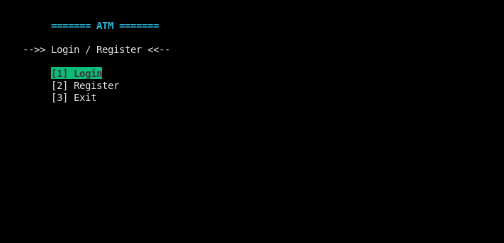

- **Register**  
  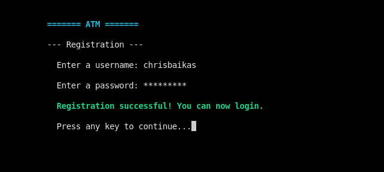

- **Login**  
  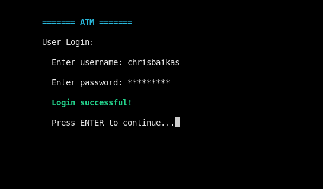

- **Main Menu**  
  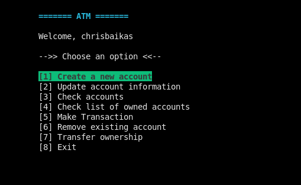

- **Create Account**  
  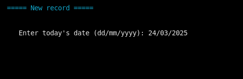

- **Update Account**  
  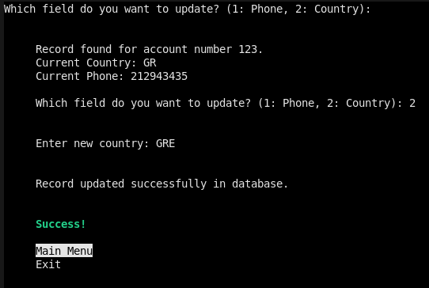

- **Check Account Details**  
  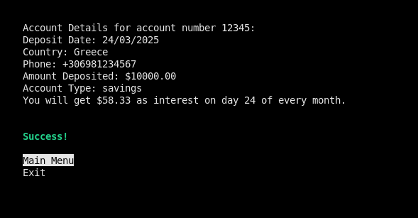

- **Check All Accounts**  
  

- **Make Transaction (Step 1)**  
  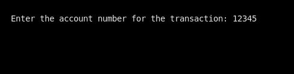

- **Make Transaction (Step 2)**  
  

- **Remove Account**  
  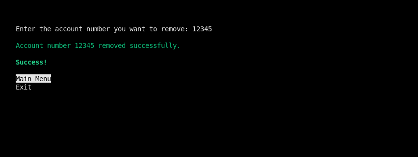

- **Real-time Transfer Notification**  
  

- **Success Screen**  
  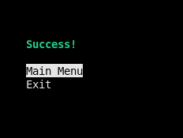

- **SQLite Table Structure**  
  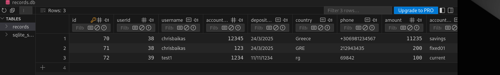

---

## 👨‍💼 Author

**Developed by Chris Baikas**  
Terminal Edition for Zone01 / University project  
Full simulation of ATM logic and UI using `ncurses` and `sqlite3`.

---

## 📚 License

This project was created for educational purposes as part of the **Zone01** program. 
Feel free to study and modify the code.

