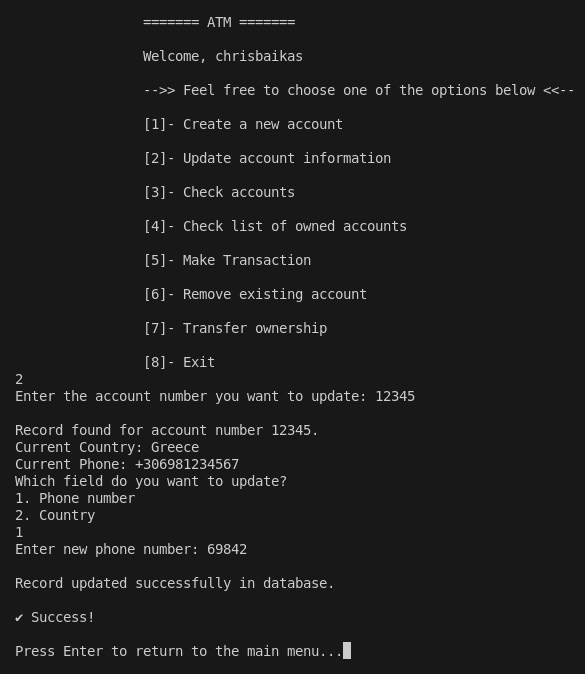

# 💳 ATM Management System – Terminal Version (No Ncurses)

A full-featured **ATM management system** built in **C**, using **SQLite** for persistent data storage and a clean terminal interface.  
No GUI. No ncurses. Just pure terminal interaction using `scanf`, `printf`, and system dialogs.

---

## ✨ Features

- 🔐 **User Authentication** (Login / Register)
- 🆕 **Create** new bank accounts
- ✏️ **Update** country or phone info
- 👁️ **View** specific account or all owned accounts
- 💸 **Deposit / Withdraw** (non-fixed accounts only)
- ❌ **Remove** accounts
- 🔀 **Transfer** account ownership to other users
- 🔔 **Live Notifications** via `pthreads` + shared memory
- ⌨️ **Menu-based navigation** with numeric input

---

## 💠 Tech Stack

| Tech       | Description                      |
|------------|----------------------------------|
| C          | Core language                    |
| SQLite3    | Lightweight SQL database         |
| pthreads   | Multithreading (notifications)   |
| Shared Mem | Inter-process communication (IPC) |

---

## 🗃️ Database Structure

### `users.db`
| Column       | Type    |
|--------------|---------|
| `id`         | INTEGER |
| `username`   | TEXT    |
| `passwordHash` | TEXT |

### `records.db`
| Column       | Type    |
|--------------|---------|
| `accountNbr` | INTEGER |
| `amount`     | REAL    |
| `userId`     | INTEGER |
| `username`   | TEXT    |
| `country`    | TEXT    |
| `phone`      | TEXT    |
| `accountType`| TEXT    |
| `depositDate`| TEXT    |

---

## ⚙️ Build Instructions

### 1. Compile

```bash
make
```

Make sure you have the following libraries installed:

✅ Required:

```bash
sudo apt install libsqlite3-dev libpthread-stubs0-dev
```

---

### 2. Run the Application

```bash
./atm
```

---

## 📸 Preview (Screenshots)

> Replace these placeholders with actual screenshots from your terminal demo.

### 🔐 Login Menu

```
======= ATM =======
-->> Login / Register <<--
[1] Login
[2] Register
[3] Exit
```

### 📋 Main Menu

```
======= ATM =======
Welcome, username

[1] Create a new account
[2] Update account information
[3] Check accounts
[4] Check list of owned accounts
[5] Make Transaction
[6] Remove existing account
[7] Transfer ownership
[8] Exit
```

## 🖼️ Screenshots (Terminal)

- **Init Menu**  
  

- **Register**  
  

- **Login**  
  

- **Main Menu**  
  

- **Create Account**  
  

- **Update Account**  
  

- **Check Account Details**  
  

- **Check All Accounts**  
  

- **Make Transaction**  
  

- **Remove Account**  
  

- **Real-time Transfer Notification**  
  


---

## 🎮 Usage Guide

- Use **number keys (1-8)** to choose from the menu.
- Input values via terminal prompts.
- Confirm actions with `Enter`.

---

## ⚠️ Notes

- Accounts of type `fixed01`, `fixed02`, or `fixed03` **do not allow transactions**.
- All data is safely stored using **SQLite3**.
- When another user transfers an account to you, you’ll receive **live notifications** on the terminal.

---

## 👨‍💻 Author

Developed by **Chris Baikas**  
🎓 Zone01 School – University-level C project  
📁 Terminal-based ATM system with full SQLite integration.

---

## 📚 License

This project was built for educational purposes as part of the Zone01 curriculum.  
Feel free to explore, learn, and improve it.